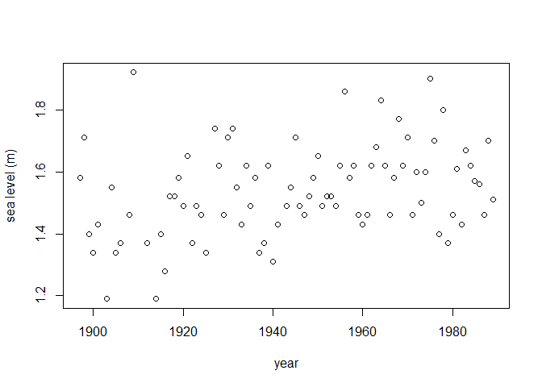
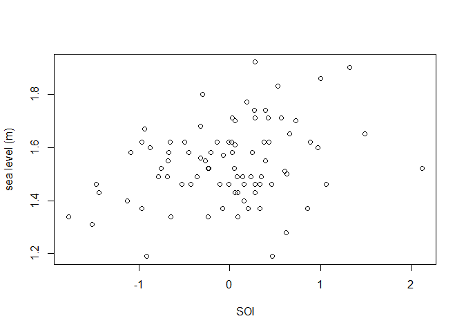
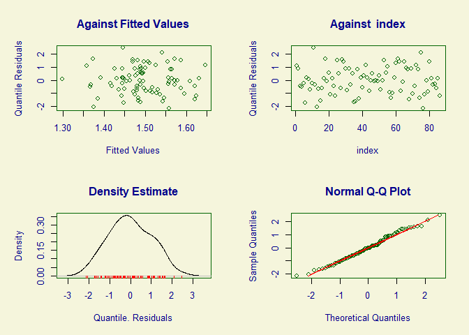
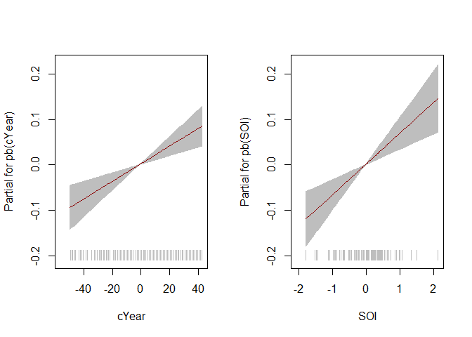
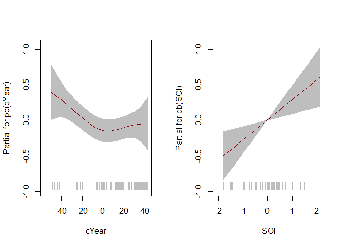

<!-- README.md is generated from README.Rmd. Please edit that file -->

# gamlssx

[](https://ci.appveyor.com/project/paulnorthrop/gamlssx/branch/main)
[](https://github.com/paulnorthrop/gamlssx/actions/workflows/R-CMD-check.yaml)
[](https://app.codecov.io/github/paulnorthrop/gamlssx?branch=master)
[](https://cran.r-project.org/package=gamlssx)
[](https://cran.r-project.org/package=gamlssx)
[](https://cran.r-project.org/package=gamlssx)

## Generalised Additive Extreme Value Models for Location, Scale and Shape

The main aim of the `gamlssx` package is to enable a generalized extreme
value (GEV) to be used as the response distribution in a generalized
additive model for location scale and shape (GAMLSS), as implemented in
the [`gamlss` R package](https://cran.r-project.org/package=gamlss). See
[Rigby and Stasinopoulos
(2005)](https://doi.org/10.1111%2Fj.1467-9876.2005.00510.x) and the
[gamlss home page](https://www.gamlss.com/) for details of the
methodology. See also Gavin Simpson’s blog post [Modelling extremes
using generalized additive
models](https://fromthebottomoftheheap.net/2017/01/25/modelling-extremes-with-gams/)
for an overview of the use of GAMs for modelling extreme values, which
uses the [mgcv R package](https://cran.r-project.org/package=mgcv) to
fit similar models and notes that the [VGAM R
package](https://cran.r-project.org/package=VGAM) can also be used.

## An example

We consider the `fremantle` data include in the `gamlssx` package, which
is a copy of data of the same name from the [`ismev` R
package]((https://cran.r-project.org/package=gamlss)). These data
contain 86 annual maximum seas levels recorded at Fremantle, Australia
during 1987-1989. In addition to the year of each sea level, we have
available the value of the Southern Oscillation Inde (SOI). We use
`gamlssx`’s `fitGEV()` function to fit a model to these data that is
similar to the first one fitted, to the same data, in Gavin Simpson’s
blog post.

The `fitGEV()` function calls the function `gamlss::gamlss()`, which
offers 3 fitting algorithms: `RS` (Rigby and Stasinopoulos), `CG` (Cole
and Green) and `mixed` (`RS` initially followed by `CG`). In the code
below, we use the default `RS` algorithm. `fitGEV()` offers 2 scoring
methods to calculate the weights used in the algorithm. Here, we use the
default, Fisher’s scoring, based on the expected Fisher information. The
code below does not do justice to the functionality of the `gamlss`
package. See the [GAMLSS books](https://www.gamlss.com/books-vignettes/)
for more information. We use the `gamlss()`The function `fitGEV()` can

``` r
# Load gamlss, for the function pb()
library(gamlss)
# Load gamlssx
library(gamlssx)
# Transform Year so that it is centred on 0 
fremantle <- transform(fremantle, cYear = Year - median(Year))
# Plot sea level against year and against SOI
plot(fremantle$Year, fremantle$SeaLevel, xlab = "year", ylab = "sea level (m)")
```



``` r
plot(fremantle$SOI, fremantle$SeaLevel, xlab = "SOI", ylab = "sea level (m)")
```



``` r
# Fit a model with P-spline effects of cYear and SOI on location and scale
# The default links are indentity for location and log for scale
mod <- fitGEV(SeaLevel ~ pb(cYear) + pb(SOI), 
              sigma.formula = ~ pb(cYear) + pb(SOI), 
              data = fremantle)
#> stepLength =  1 
#> GAMLSS-RS iteration 1: Global Deviance = -112.2422 
#> GAMLSS-RS iteration 2: Global Deviance = -117.4965 
#> GAMLSS-RS iteration 3: Global Deviance = -118.3007 
#> GAMLSS-RS iteration 4: Global Deviance = -118.6081 
#> GAMLSS-RS iteration 5: Global Deviance = -118.7582 
#> GAMLSS-RS iteration 6: Global Deviance = -118.8344 
#> GAMLSS-RS iteration 7: Global Deviance = -118.8731 
#> GAMLSS-RS iteration 8: Global Deviance = -118.8987 
#> GAMLSS-RS iteration 9: Global Deviance = -118.9102 
#> GAMLSS-RS iteration 10: Global Deviance = -118.9188 
#> GAMLSS-RS iteration 11: Global Deviance = -118.9258 
#> GAMLSS-RS iteration 12: Global Deviance = -118.9269 
#> GAMLSS-RS iteration 13: Global Deviance = -118.9351 
#> GAMLSS-RS iteration 14: Global Deviance = -118.9359
```

``` r
# Summary of model fit
summary(mod)
#> ******************************************************************
#> Family:  c("GEV", "Generalized Extreme Value") 
#> 
#> Call:  gamlss::gamlss(formula = SeaLevel ~ pb(cYear) + pb(SOI),  
#>     sigma.formula = ~pb(cYear) + pb(SOI), family = GEVfisher(mu.link = "identity",  
#>         sigma.link = "log", nu.link = "identity"),  
#>     data = fremantle, mu.step = 1, sigma.step = 1,      nu.step = 1) 
#> 
#> Fitting method: RS() 
#> 
#> ------------------------------------------------------------------
#> Mu link function:  identity
#> Mu Coefficients:
#>              Estimate Std. Error t value Pr(>|t|)    
#> (Intercept) 1.5007933  0.0149733 100.231  < 2e-16 ***
#> pb(cYear)   0.0019490  0.0004982   3.912 0.000195 ***
#> pb(SOI)     0.0680347  0.0174751   3.893 0.000208 ***
#> ---
#> Signif. codes:  0 '***' 0.001 '**' 0.01 '*' 0.05 '.' 0.1 ' ' 1
#> 
#> ------------------------------------------------------------------
#> Sigma link function:  log
#> Sigma Coefficients:
#>              Estimate Std. Error t value Pr(>|t|)    
#> (Intercept) -2.128696   0.088447 -24.068   <2e-16 ***
#> pb(cYear)   -0.004574   0.002614  -1.750   0.0841 .  
#> pb(SOI)      0.275258   0.112736   2.442   0.0169 *  
#> ---
#> Signif. codes:  0 '***' 0.001 '**' 0.01 '*' 0.05 '.' 0.1 ' ' 1
#> 
#> ------------------------------------------------------------------
#> Nu link function:  identity 
#> Nu Coefficients:
#>             Estimate Std. Error t value Pr(>|t|)   
#> (Intercept) -0.25619    0.08582  -2.985  0.00379 **
#> ---
#> Signif. codes:  0 '***' 0.001 '**' 0.01 '*' 0.05 '.' 0.1 ' ' 1
#> 
#> ------------------------------------------------------------------
#> NOTE: Additive smoothing terms exist in the formulas: 
#>  i) Std. Error for smoothers are for the linear effect only. 
#> ii) Std. Error for the linear terms maybe are not accurate. 
#> ------------------------------------------------------------------
#> No. of observations in the fit:  86 
#> Degrees of Freedom for the fit:  8.375675
#>       Residual Deg. of Freedom:  77.62432 
#>                       at cycle:  14 
#>  
#> Global Deviance:     -118.9359 
#>             AIC:     -102.1846 
#>             SBC:     -81.62773 
#> ******************************************************************
```

``` r
# Model diagnostic plots
plot(mod)
```



    #> ******************************************************************
    #>        Summary of the Quantile Residuals
    #>                            mean   =  -0.006109438 
    #>                        variance   =  1.036755 
    #>                coef. of skewness  =  0.09394729 
    #>                coef. of kurtosis  =  2.322565 
    #> Filliben correlation coefficient  =  0.9951795 
    #> ******************************************************************

``` r
# Plot of the fitted component smooth functions
# Note: gamlssx::term.plot() does not include uncertainty about the intercept
term.plot(mod, rug = TRUE, pages = 1)
```



``` r
term.plot(mod, what = "sigma", pages = 1)
```



## Installation

To get the current released version from CRAN:

``` r
install.packages("gamlssx")
```
